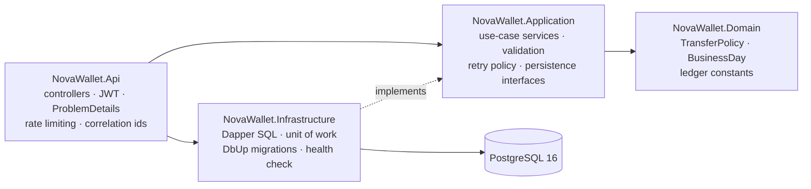

# NovaWallet Ledger Service

A wallet ledger service for NovaWallet, a Nigerian digital wallet, built in .NET 8 with PostgreSQL and Dapper.

The service creates NGN wallets, posts inbound NIP credits, moves money between wallets, and serves paginated statements. Its one non-negotiable job is to **never lose, duplicate or miscount money**, including under concurrent load. Most of the design below exists to make that guarantee hold in the database, not just in application code.

---

## Contents
1. [Quick start](#1-quick-start)
2. [Running the tests](#2-running-the-tests)
3. [Architecture](#3-architecture)
4. [Key design decisions](#4-key-design-decisions)
5. [Security and privacy](#5-security-and-privacy)
6. [Observability](#6-observability)
7. [API reference](#7-api-reference)
8. [Testing strategy](#8-testing-strategy)
9. [Assumptions](#9-assumptions)
10. [Trade-offs and what I would do next](#10-trade-offs-and-what-i-would-do-next)

---

## 1. Quick start

**Prerequisites:** Docker Desktop.

```bash
docker compose up --build
```

This starts PostgreSQL 16 and the API. The API waits for the database health check, applies migrations, then listens on port 8080.

| URL | Purpose |
|---|---|
| http://localhost:8080/swagger | Swagger UI / OpenAPI spec |
| http://localhost:8080/health/live | Liveness (process is up) |
| http://localhost:8080/health/ready | Readiness (PostgreSQL reachable) |

PostgreSQL is published on host port **5433** so it does not clash with a local installation. Stop with `docker compose down`; add `-v` to wipe the database.

### Walkthrough (bash + `jq`)

Tokens come from a **mock issuer** that is enabled only when `DevAuth:Enabled=true` (it is in `docker-compose.yml` for the demo).

```bash
API=http://localhost:8080/api/v1

# 1. Tokens: two customers, plus the internal NIP settlement service (the only caller allowed to post credits)
ADA=$(curl -s -X POST $API/dev/token -H 'Content-Type: application/json' -d '{"customerId":"cust-ada"}' | jq -r .accessToken)
TUNDE=$(curl -s -X POST $API/dev/token -H 'Content-Type: application/json' -d '{"customerId":"cust-tunde"}' | jq -r .accessToken)
NIP=$(curl -s -X POST $API/dev/token -H 'Content-Type: application/json' -d '{"customerId":"svc-nip","scopes":["ledger:credit"]}' | jq -r .accessToken)

# 2. Wallets (the owner comes from the token's `sub`, never from the body)
ADA_WALLET=$(curl -s -X POST $API/wallets -H "Authorization: Bearer $ADA" | jq -r .walletId)
TUNDE_WALLET=$(curl -s -X POST $API/wallets -H "Authorization: Bearer $TUNDE" | jq -r .walletId)

# 3. Inbound NIP credit of ₦20,000 (2,000,000 kobo). Idempotent on externalReference.
curl -s -X POST $API/wallets/$ADA_WALLET/credits -H "Authorization: Bearer $NIP" \
  -H 'Content-Type: application/json' \
  -d '{"amountKobo":2000000,"externalReference":"NIP-000123","narration":"Salary"}' | jq

# 4. Transfer ₦7,500. Run it twice: the second call replays the original result (Idempotent-Replayed: true).
KEY=$(uuidgen)
curl -si -X POST $API/transfers -H "Authorization: Bearer $ADA" -H "Idempotency-Key: $KEY" \
  -H 'Content-Type: application/json' \
  -d "{\"sourceWalletId\":\"$ADA_WALLET\",\"destinationWalletId\":\"$TUNDE_WALLET\",\"amountKobo\":750000,\"narration\":\"Lunch\"}"

# 5. Balance and statement (owner only)
curl -s $API/wallets/$ADA_WALLET/balance -H "Authorization: Bearer $ADA" | jq
curl -s "$API/wallets/$ADA_WALLET/transactions?limit=20" -H "Authorization: Bearer $ADA" | jq
```

In Swagger, call `POST /api/v1/dev/token`, copy `accessToken`, click **Authorize**, and paste it.

### Running outside Docker

```bash
export ConnectionStrings__Ledger="Host=localhost;Port=5432;Database=novawallet;Username=...;Password=..."
dotnet run --project src/NovaWallet.Api      # http://localhost:5080/swagger
```

`appsettings.Development.json` points at the Compose database on port 5433 and holds a **local-only** signing key.

---

## 2. Running the tests

```bash
dotnet test NovaWallet.sln
```

| Suite | Count | Needs |
|---|---|---|
| `NovaWallet.UnitTests` | 53 | Nothing |
| `NovaWallet.IntegrationTests` | 92 | A real PostgreSQL |

Integration tests **always run against real PostgreSQL**, because the guarantees under test (row locks, unique-index waits, constraints, triggers) only exist in the real engine. The fixture picks the database in one of two ways:

- **Default:** Testcontainers starts `postgres:16-alpine`. Requires Docker.
- **Existing server:** set `NOVAWALLET_TEST_POSTGRES` to a connection string for a login with `CREATEDB`. Each run creates `novawallet_test_<guid>` and drops it afterwards.

```bash
export NOVAWALLET_TEST_POSTGRES="Host=localhost;Port=5432;Username=novawallet;Password=...;Database=postgres"
```

The whole suite runs in roughly 15 seconds, including the 100-request concurrency tests.

---

## 3. Architecture

A modular monolith with clean-architecture layering. Dependencies point inward only.



| Layer | Responsibility |
|---|---|
| **Domain** | Pure business rules with no I/O: `TransferPolicy.Evaluate` (funds, then daily limit), `BusinessDay.For` (UTC → Africa/Lagos date), limits and constants. |
| **Application** | One service per use case behind an interface (`IWalletService`, `ICreditService`, `ITransferService`, `IStatementService`). It owns the transaction flow, validation, idempotency outcome serialization and the deadlock retry policy. It depends only on abstractions. |
| **Infrastructure** | Explicit Dapper SQL. A focused unit of work exposes four narrow interfaces that share **one** `NpgsqlTransaction`: `Wallets`, `IdempotencyKeys`, `DailyOutboundTotals`, `Journal`, `Outbox`. It also runs migrations (DbUp, embedded SQL scripts), the outbox relay background service and the readiness check. |
| **Api** | Thin controllers that map DTOs, errors (RFC 7807) and auth to the Application layer. |

The boundaries are drawn so the ledger could later be extracted as its own service. No MediatR, generic repositories, EF Core, Redis, message brokers or distributed locks: the only source of financial truth is PostgreSQL.

```
src/
  NovaWallet.Domain/           TransferPolicy, BusinessDay, LedgerConstants
  NovaWallet.Application/      Wallets/ Credits/ Transfers/ Statements/ Abstractions/ Common/
  NovaWallet.Infrastructure/   Persistence/ (Ledger/ unit of work parts), Migrations/Scripts/*.sql
  NovaWallet.Api/              Controllers/ Auth/ Contracts/ Observability/ RateLimiting/ ExceptionHandling/
tests/
  NovaWallet.UnitTests/        policy, validation, cursor, hashing, retry, TransferService with fakes
  NovaWallet.IntegrationTests/ real HTTP pipeline + real PostgreSQL, incl. concurrency suites
```

### Data model

| Table | Purpose | Key constraints |
|---|---|---|
| `wallets` | Current balance per wallet | `balance_kobo >= 0`, `currency = 'NGN'`, `UNIQUE (customer_id, currency)` |
| `ledger_transactions` | One row per business event (credit or transfer) | `amount_kobo > 0`; shape check (credit has no source, transfer source ≠ destination); **unique `external_reference`** |
| `ledger_entries` | One row per wallet movement; feeds the statement | `balance_after_kobo >= 0`; index `(wallet_id, entry_no DESC)` |
| `daily_outbound_totals` | Outbound total per wallet per Lagos business day | PK `(wallet_id, business_date)`, `total_kobo >= 0` |
| `idempotency_keys` | Claimed keys and their stored outcome | PK `(customer_id, operation, idempotency_key)` |
| `audit_log` | Append-only audit trail, separate from transactions | `balance_after = balance_before ± amount` enforced by CHECK |
| `outbox_messages` | `TransferCompleted` events awaiting delivery | `UNIQUE (event_type, aggregate_id)`; partial index on unpublished, due rows |

`audit_log`, `ledger_entries` and `ledger_transactions` are **append-only**: triggers reject `UPDATE`, `DELETE` and `TRUNCATE`. Every money column is `BIGINT` kobo, and every timestamp is `timestamptz` (UTC).

---

## 4. Key design decisions

### 4.1 Money is integer kobo, end to end
- **Types:** amounts are `long` in C#, `BIGINT` in PostgreSQL, and integers in JSON. No `float`, `double` or `decimal` appears in the money path.
- **Strict JSON:** the API rejects `100.5`, `"100"` and unknown fields such as `"currency": "USD"` with `400`. They are never coerced.
- **Overflow guard:** a single amount is capped at ₦10bn (10¹² kobo), so no sum can approach `bigint` overflow and every amount stays inside JavaScript's safe-integer range.

### 4.2 Concurrency: how transfers stay correct

Every transfer runs in **one READ COMMITTED transaction** in this order:

```
BEGIN
 1. Claim Idempotency-Key       INSERT … ON CONFLICT DO NOTHING RETURNING 1
 2. Lock both wallets           SELECT … WHERE id IN (@a,@b) ORDER BY id FOR UPDATE
 3. Check under lock            ownership · active status · TransferPolicy (funds, then daily limit)
      └─ rejected? store the outcome against the key and COMMIT (nothing else was written)
 4. Debit (guarded)             UPDATE wallets SET balance_kobo = balance_kobo - @amt
                                  WHERE id = @src AND balance_kobo >= @amt RETURNING balance_kobo
 5. Credit                      UPDATE wallets SET balance_kobo = balance_kobo + @amt … RETURNING balance_kobo
 6. Daily total (guarded)       INSERT … ON CONFLICT DO UPDATE … WHERE total + @amt <= @limit RETURNING total
 7. Journal                     1 ledger_transactions row, 2 ledger_entries rows, 2 audit_log rows, 1 outbox_messages row
 8. Store outcome, COMMIT
```

**The race this prevents.** A naive read-then-write lets two requests spend the same balance:

```
T1: SELECT balance → 10,000 ✓        T2: SELECT balance → 10,000 ✓
T1: UPDATE balance = 0 · COMMIT      T2: UPDATE balance = 0 · COMMIT     → 20,000 left a 10,000 wallet
```

With step 2, T2 blocks on the row lock until T1 commits, then reads the true balance.

**Three layers of protection:**

| Layer | Mechanism | Role |
|---|---|---|
| 1 | `FOR UPDATE` row locks | The primary guarantee. Balance and daily total cannot change between the check and the write. |
| 2 | Conditional SQL (`WHERE balance_kobo >= @amt`, guarded upsert) | If locking were ever broken, the write refuses. Zero rows means a thrown invariant violation and a full rollback. |
| 3 | `CHECK (balance_kobo >= 0)` | The database physically cannot store a negative balance. |

**Deadlocks.** If T1 (A→B) locks A then waits for B while T2 (B→A) holds B and waits for A, the two transactions deadlock. Locking **both rows in one statement ordered by `id`** means every transaction acquires locks in the same order, so no cycle can form. The ordering comes from PostgreSQL, deliberately not from C#: `Guid.CompareTo` sorts differently from PostgreSQL's `uuid` comparison, and mixing the two would reintroduce deadlocks. As a backstop, a deadlock (`40P01`) or serialization failure (`40001`) rolls the transaction back and `ConcurrencyRetryPolicy` re-runs the **whole** transaction up to 3 times with jitter. If all attempts fail, the client gets `503` with `Retry-After`.

**Credits** are a single atomic statement (`SET balance_kobo = balance_kobo + @amt … RETURNING`). The row lock serializes concurrent credits, so none are lost.

### 4.3 Idempotency

- **Transfers need an `Idempotency-Key` header** (1–100 chars). Keys are scoped per customer: two customers can both send `order-123`.
- **Fingerprint:** the request hash is SHA-256 of a **canonical** string (`source|destination|amount|currency|narration`), not the raw JSON, so whitespace or property order never counts as a different payload.
- **Same transaction as the money:** the key is claimed **inside the same transaction** as the money movement. That gives:
  - **Concurrent duplicates:** the second `INSERT … ON CONFLICT` blocks on the first transaction's uncommitted unique-index entry. When the first commits, the second finds the committed outcome and replays it. One hundred simultaneous requests with the same key produce exactly one transfer (tested).
  - **Crash safety:** a key is never committed without its outcome, so there is no stuck "in-progress" key to expire or repair.
- **Replay:** same key and same payload return the **original status and body** with `Idempotent-Replayed: true`. Same key with a different payload returns `422 idempotency_key_reused`.
- **Business rejections are stored too.** A key that got `422 insufficient_funds` keeps returning it, even after the wallet is topped up: a key identifies one request, not a retry-until-success loop. Validation errors (`400`) and transient failures (`503`) are **not** stored, so the client can fix and retry with the same key.
- **Credits** are idempotent on their **NIP `externalReference`**, enforced by a unique index. That is stronger than a client-chosen key: two different keys still cannot credit the same inbound transfer twice. A replay returns the original receipt; the same reference with a different payload returns `409 external_reference_conflict`.

### 4.4 Daily outbound limit (₦500,000 / 50,000,000 kobo)

- **Storage:** `daily_outbound_totals` holds one row per wallet per **Africa/Lagos business day**. Midnight WAT starts a new row, so no reset job is needed.
- **Business day:** computed with an injected `TimeProvider` (WAT is UTC+1 with no DST), which lets tests cross 23:59:59 → 00:00:00 Lagos time deterministically. A transfer at 23:30 UTC on 1 March counts against **2 March**.
- **Concurrency:** the source wallet lock serializes all outbound transfers from a wallet, so a check can never read a stale total. The upsert also refuses to exceed the limit on its own.
- **Tiers:** the limit is a per-wallet column (`daily_outbound_limit_kobo`), ready for tiered KYC limits without a schema change.

### 4.5 Audit trail
- **Contents:** every balance mutation writes an `audit_log` row: wallet, transaction, action, amount, balance before/after, actor (`sub`), correlation ID and timestamp.
- **Same transaction:** audit rows are written in the same transaction as the mutation, so they cannot diverge from balances.
- **Integrity in the database:** triggers reject `UPDATE`, `DELETE` and `TRUNCATE`, and a CHECK constraint enforces `after = before ± amount`.
- **Data minimization:** no BVN, NIN, names or phone numbers are recorded.

### 4.6 Statements
- **Endpoint:** `GET /wallets/{id}/transactions?limit=&cursor=` returns entries newest first, with **keyset pagination** on `entry_no` and an opaque cursor.
- **Why keyset, not OFFSET:** with OFFSET, a transfer arriving while a user pages through shifts the rows, so entries get skipped or repeated.
- **Why `entry_no` order is safe:** a wallet's entry is always inserted while that wallet's row lock is held, and the lock is released at commit. So for a given wallet, `entry_no` order equals commit order, and a late commit cannot slip behind a cursor the client has already passed.

### 4.7 Outbox: `TransferCompleted` events

**Guarantee:** an event exists **if and only if** the transfer committed.

- **Write side:** step 7 of the transfer also inserts an `outbox_messages` row, in the **same transaction** as the debit, credit, entries and audit rows. Rejections, rollbacks and idempotent replays therefore write no event, and `UNIQUE (event_type, aggregate_id)` makes a second event for one transfer impossible.
- **Why not publish directly:** calling a broker inside the transaction would let a rollback follow a successful publish (a phantom event), and publishing after commit would lose the event if the process crashed in between.
- **Relay:** `OutboxRelayService` (a background service) repeatedly claims a batch:
  ```sql
  SELECT … FROM outbox_messages
  WHERE published_at IS NULL AND next_attempt_at <= now()
  ORDER BY occurred_at LIMIT @batchSize
  FOR UPDATE SKIP LOCKED
  ```
  `SKIP LOCKED` lets several API instances relay in parallel without claiming the same row. On success a row gets `published_at`; on failure `attempts`, `last_error` and an exponential `next_attempt_at` (capped at 5 minutes).
- **Delivery semantics:** **at-least-once**. A crash after the broker accepts an event but before `published_at` commits re-sends it, so consumers dedupe on `eventId`.
- **Publisher:** no message broker is in scope, so `IEventPublisher` is implemented by a structured-logging publisher (`Published "TransferCompleted" <eventId> for aggregate <transactionId>`). A Kafka or Service Bus publisher is one new class; the relay does not change.
- **Payload:** `eventId`, `transactionId`, source/destination wallet IDs, `amountKobo`, `currency`, `businessDate`, `occurredAt`, `correlationId`. Balances and narration are deliberately excluded (data minimization).
- **Configuration:** `Outbox:RelayEnabled`, `PollIntervalMilliseconds` (2000), `BatchSize` (100), `MaxBackoffSeconds` (300).

### 4.8 Why these choices over the alternatives

| Alternative | Why not |
|---|---|
| `SERIALIZABLE` isolation | Also correct, but every request then needs retry handling for serialization failures, and the failure behaviour is harder to reason about. Explicit locks are predictable. |
| Optimistic concurrency (version column) | Under contention on a hot wallet it turns into a retry storm; pessimistic row locks give orderly queuing for money movement. |
| Redis/distributed locks | A second source of truth. PostgreSQL already provides the locks, inside the same transaction as the writes. |
| Separate "in-progress" idempotency row committed first | Needs expiry and recovery for crashed requests. Claiming inside the money transaction avoids both. |

---

## 5. Security and privacy

- **Authentication:** JWT bearer (HS256) with issuer, audience, lifetime and signature validation, and 30s clock skew. `MapInboundClaims=false`, so `sub` stays `sub`.
- **Signing key:** read from configuration (`Jwt__SigningKey`), never committed for production. Startup **fails** if the key is missing or shorter than 256 bits.
- **Mock issuer:** `POST /api/v1/dev/token` exists because the brief allows a simplified issuer. It returns `404` unless `DevAuth:Enabled=true`, which is off by default and on only in `docker-compose.yml` for the demo.
- **Resource-level authorization:**
  - The wallet owner is always the token `sub`; the request body can never choose it.
  - Balance, statement and transfer-source access require ownership. Another customer's wallet returns **`404`, not `403`**, so wallet IDs cannot be probed.
  - Posting credits requires the `ledger:credit` scope (held by the internal NIP settlement service). Customers cannot credit their own wallet.
- **Input validation:**
  - Amount range, NGN only, source ≠ destination.
  - Reference and idempotency-key character whitelists, narration length with no control characters.
  - Strict JSON (unknown fields and non-integer numbers rejected), GUID route constraints.
- **Rate limiting:** `POST /transfers` is limited per authenticated `sub` (default 20 per 60s). The limiter runs after authentication, so it keys on the verified identity rather than a spoofable header. Excess requests get `429` with `Retry-After`.
- **Secrets and logs:**
  - Request bodies, headers and tokens are never logged; I verified that container logs contain no JWT fragment, `Authorization` header or database password.
  - Connection strings are never logged.
  - Npgsql error detail stays redacted.
  - The container runs as a non-root user.
- **Privacy (NDPA 2023):**
  - The ledger stores only an opaque `customer_id`. BVN, NIN, names and phone numbers belong to the KYC/identity service, not the ledger.
  - The transfer receipt returns only the **sender's** balance, never the recipient's.
  - Statements show counterparty wallet IDs, not identities.
- **Demo-only values:** `docker-compose.yml` contains a demo database password and signing key, clearly marked, both overridable via `POSTGRES_PASSWORD` / `JWT_SIGNING_KEY`. Use a secret store anywhere else.

---

## 6. Observability

- **Structured logs:** JSON to stdout via Serilog, with `CorrelationId` on every line.
- **Correlation IDs:**
  - Source: a client-supplied `X-Correlation-ID` is accepted only if it is at most 64 chars of `[A-Za-z0-9_.:-]`; otherwise one is generated. Client values reach the audit trail, so unsafe values are never trusted.
  - Destinations: the response header, ProblemDetails (`correlationId`, alongside `traceId`), `ledger_transactions.correlation_id` and `audit_log.correlation_id`. One ID traces a request from the mobile app to its audit rows.
- **Request logging:** request logging wraps the exception handler, so each log line records the status the client actually received.
- **Health:** `/health/live` checks only the process (so a database blip does not restart the container), and `/health/ready` checks PostgreSQL.

---

## 7. API reference

All amounts are integer **kobo**. All endpoints except dev token and health require `Authorization: Bearer <jwt>`.

| Method & path | Auth | Success | Notes |
|---|---|---|---|
| `POST /api/v1/wallets` | customer | `201` | One NGN wallet per customer; `409` includes the existing `walletId`. |
| `GET /api/v1/wallets/{id}/balance` | owner | `200` | |
| `POST /api/v1/wallets/{id}/credits` | `ledger:credit` scope | `201` | Idempotent on `externalReference`. |
| `POST /api/v1/transfers` | owner of source | `201` | Requires `Idempotency-Key`; rate limited. |
| `GET /api/v1/wallets/{id}/transactions?limit=20&cursor=` | owner | `200` | `limit` 1–100; follow `nextCursor` until `null`. |
| `POST /api/v1/dev/token` | none (demo only) | `200` | `{"customerId": "...", "scopes": ["ledger:credit"]}` |
| `GET /health/live`, `GET /health/ready` | none | `200` | |

Errors are RFC 7807 `application/problem+json` with a stable `errorCode`, `traceId` and `correlationId`:

| Status | `errorCode` |
|---|---|
| 400 | `validation_failed` (field errors in `errors`) |
| 401 | missing or invalid token |
| 403 | `insufficient_scope` |
| 404 | `wallet_not_found`, `source_wallet_not_found`, `destination_wallet_not_found` |
| 409 | `wallet_already_exists`, `external_reference_conflict` |
| 422 | `insufficient_funds`, `daily_limit_exceeded` (with `dailyLimitKobo`, `remainingTodayKobo`), `wallet_not_active`, `idempotency_key_reused` |
| 429 | `rate_limited` |
| 500 | `ledger_invariant_violation` (rolled back; no funds moved) |
| 503 | `concurrency_conflict` (rolled back; retry with the same key) |

---

## 8. Testing strategy

**145 tests: 53 unit, 92 integration.**

- **Integration tests** drive the real HTTP pipeline (JWT, validation, controllers) against real PostgreSQL.
- **Ledger replay check:** every money test ends with `AssertWalletLedgerConsistentAsync`. It replays a wallet's entries in order and asserts that the running balance never goes negative, each `balance_after` matches, each entry has a matching audit row, and the final sum equals the stored balance.

| Area | Highlights |
|---|---|
| Concurrency | **100 concurrent 10,000-kobo transfers from a 100,000 balance → exactly 10 succeed, 90 `insufficient_funds`, source 0, destination 100,000.** 50 A→B + 50 B→A at once → all succeed, balances unchanged, no deadlock. Concurrent credits and transfers on one wallet. 50 concurrent credits with no lost updates. |
| Idempotency | Same key + payload replays; different payload rejected; per-customer scoping; stored rejections replay; **100 concurrent requests with one key → exactly one transfer**; 20 concurrent duplicate credit references → one credit. |
| Daily limit | Exactly ₦500k allowed and 1 kobo more rejected; a crossing transfer rejected whole; 30 concurrent ₦50k transfers → exactly 10 succeed; **reset at midnight Africa/Lagos, not UTC**. |
| Outbox | A committed transfer writes exactly one event with a minimal payload; rejections and 20 concurrent same-key replays write none extra; 100 concurrent overspend attempts → exactly 10 events; the relay publishes once and marks rows published; a broker failure backs off and is delivered later; **4 concurrent relays over 40 events → each published exactly once**. |
| Schema invariants | 20 tests proving the database itself rejects negative balances, non-NGN, duplicate wallets, self-transfers, duplicate NIP references, inconsistent audit arithmetic, and any update, delete or truncate of posted records. |
| Security & API | 401 for missing/forged tokens, 403 without scope, 404 for other customers' wallets, strict JSON, correlation-ID sanitisation, per-customer rate limiting, ProblemDetails content type. |
| Unit (no DB) | `TransferPolicy`, `BusinessDay`, validation, request hashing, cursor tamper-resistance, retry policy, and `TransferService` against fakes (a reused key never locks wallets; a failed guarded debit never commits). |

### Proof the tests catch real bugs (mutation experiments)

I deliberately broke the implementation to confirm the tests fail for the right reason, then restored it:

| Mutation | Result |
|---|---|
| Credit as read-then-write instead of an atomic `UPDATE` | 50 concurrent credits all returned `201`, but the balance was **1,000 instead of 50,000**: 49 lost updates. Caught. |
| Lock source then destination (request order) instead of `ORDER BY id` | PostgreSQL `40P01` deadlocks; **93 of 100** opposing transfers failed with `503` and the test took 33s. With ordered locking all 100 succeed. Caught. |
| Remove `FOR UPDATE` | The guarded SQL still prevented any overspend, but **49 correct `422`s became `500`s**. The lock gives correctness; the conditional SQL is the safety net. Caught. |
| Drop the non-negative CHECK and the audit trigger | Exactly the 3 matching schema tests failed. |
| Remove `FOR UPDATE SKIP LOCKED` from the outbox relay | 4 concurrent relays published **160 times for 40 events**: every event delivered 4 times. Caught. |

Details are in [AI_USAGE.md](AI_USAGE.md).

---

## 9. Assumptions

- **One wallet:** one NGN wallet per customer.
- **Currency:** NGN only; the `currency` field is optional and must be `NGN` if sent.
- **Credits:** credits simulate inbound NIP transfers and are posted by an internal service holding `ledger:credit`, not by customers. `externalReference` stands in for the NIP session ID.
- **Recipients:** any existing active wallet can receive a P2P transfer. Knowing a wallet ID is enough to send to it, as with an account number.
- **Limit scope:** the daily limit applies to **outbound transfers only**; inbound credits are not limited.
- **Receipts:** a transfer receipt shows the sender's post-transfer balance only.
- **Wallet status:** wallets can be `ACTIVE` or `FROZEN` in the schema, but no freeze API exists (out of scope).
- **Credit limit:** a single transaction is capped at ₦10bn.

---

## 10. Trade-offs and what I would do next

| Area | Current | Next step |
|---|---|---|
| Database roles | One role runs migrations and the app, so a superuser could bypass triggers | Separate migrator role; app role with only `INSERT`/`SELECT` on ledger tables |
| Double-entry | A credit writes one entry (no contra account) | Post credits against a NIP settlement/suspense wallet so all entries sum to zero; nightly reconciliation job |
| Idempotency key retention | Kept indefinitely | 24–72h TTL with a cleanup job |
| Events | Transactional outbox with a logging publisher; published rows are kept | Real broker publisher; retention job for published rows; a dead-letter state after N attempts; outbox events for credits |
| Auth | HS256 mock issuer | Real identity provider with asymmetric keys (RS256/ES256) via JWKS; KYC tier claims driving the daily limit |
| Rate limiting | In-memory, per instance | Distributed limiter at the gateway if horizontally scaled |
| Hot wallets | Row lock serializes a single wallet's transfers | Fine for P2P; high-volume merchant wallets (NovaBiz) would need batching or sub-accounts |
| Observability | Logs and correlation IDs | OpenTelemetry traces and metrics (transfer latency, lock waits, retry count) |
| Audit tamper evidence | DB triggers | Hash-chained audit rows or streaming to write-once storage |
