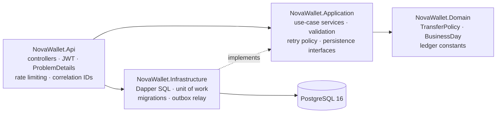

# NovaWallet Ledger Service

A wallet ledger for the NovaWallet module of FirstBank NovaPay, built with **.NET 8, PostgreSQL 16 and Dapper**.

It creates NGN wallets, posts inbound NIP credits, moves money between wallets, enforces a daily outbound limit and serves paginated statements. Its one job that cannot fail is to **never lose, duplicate or miscount a customer's money**, including when many requests hit the same wallet at once. Almost every decision below exists to make that guarantee hold inside the database, not only in application code.

> **Run it:** `docker compose up --build`, then open http://localhost:8080/swagger. Section 5 has a full walkthrough.
>
> **Test it:** `dotnet test NovaWallet.sln`. **210 tests, all passing.** Section 6 lists every one.

---

## Contents

1. [The brief, and where each requirement is met](#1-the-brief-and-where-each-requirement-is-met)
2. [Architecture](#2-architecture)
3. [Key design decisions](#3-key-design-decisions)
4. [Trade-offs, assumptions and next steps](#4-trade-offs-assumptions-and-next-steps)
5. [How to run](#5-how-to-run)
6. [How to test](#6-how-to-test)
7. [API reference](#7-api-reference)

---

## 1. The brief, and where each requirement is met

The table below maps the brief to the design (section 3) and to the tests that prove it (section 6). The rest of this README explains each row.

| Requirement | How it is met | Proven by |
|---|---|---|
| **Create wallet** | One NGN wallet per customer; the owner is always the token's `sub` | `WalletTests` |
| **Get balance** | Integer kobo and `NGN`, visible to the owner only | `WalletTests` |
| **Credit wallet** | Posted by the internal NIP settlement identity (`ledger:credit` scope); idempotent on the NIP reference | `CreditTests` |
| **Atomic, concurrency-safe transfer** | One database transaction; both wallets locked in a fixed order; guarded SQL; `CHECK (balance >= 0)` | `TransferTests`, `TransferConcurrencyTests`, `FailureAtomicityTests` |
| **Idempotency-Key** | Key claimed inside the money transaction; the outcome is replayed; a different payload is rejected | `IdempotencyTests` |
| **Statement** | Keyset pagination, newest first | `StatementTests` |
| **Daily limit, reset at midnight WAT** | Per-wallet total per Africa/Lagos business day, checked under lock | `DailyLimitTests` |
| **Append-only audit log** | Separate `audit_log` table; triggers block `UPDATE`/`DELETE`/`TRUNCATE` | `SchemaInvariantTests` |
| **Integer kobo only** | `long`/`BIGINT` end to end; strict JSON rejects `100.5` and `"100"` | `CreditTests`, `InputSecurityTests` |
| **JWT bearer check** | HS256 validation of issuer, audience, lifetime and signature; mock issuer for the demo | `AuthenticationTests` |
| **Structured errors** | RFC 7807 `application/problem+json` with a stable `errorCode` | All HTTP tests |
| **`docker compose up`** | API + PostgreSQL; migrations run on startup | `HealthAndDocsTests`, manual smoke test |
| **OpenAPI** | Swagger UI at `/swagger` | `HealthAndDocsTests` |
| **Concurrency test under load** | 100 simultaneous transfers against one wallet, and more | `TransferConcurrencyTests` |
| **AI_USAGE.md** | Tools, prompts, and cases where the AI was wrong | [AI_USAGE.md](AI_USAGE.md) |
| *Stretch:* rate limiting | Per customer on `POST /transfers` | `ObservabilityAndRateLimitTests` |
| *Stretch:* outbox `TransferCompleted` | Transactional outbox + `SKIP LOCKED` relay | `OutboxTests` |
| *Stretch:* structured logs, correlation IDs | Serilog JSON; correlation ID from request to audit row | `ObservabilityAndRateLimitTests`, `LoggingSecurityTests` |
| *Stretch:* health/readiness | `/health/live`, `/health/ready` | `HealthAndDocsTests` |

---

## 2. Architecture

### 2.1 Layers

A modular monolith with clean-architecture layering. Dependencies point inward only, and the ledger could later be split out as its own service without reshaping the code.



| Layer | Responsibility |
|---|---|
| **Domain** | Pure business rules with no I/O: `TransferPolicy.Evaluate` (funds first, then daily limit), `BusinessDay.For` (UTC instant → Lagos date), limits and constants. |
| **Application** | One service per use case behind an interface (`IWalletService`, `ICreditService`, `ITransferService`, `IStatementService`). Owns the transaction flow, validation, idempotency outcomes and the deadlock retry policy. Depends only on abstractions. |
| **Infrastructure** | Explicit Dapper SQL. A unit of work exposes narrow parts (`Wallets`, `IdempotencyKeys`, `DailyOutboundTotals`, `Journal`, `Outbox`) that all share **one** `NpgsqlTransaction`. Also runs DbUp migrations, the outbox relay and the readiness check. |
| **Api** | Thin controllers that map DTOs, authentication and errors (RFC 7807) onto the Application layer. |

There is no EF Core, MediatR, Redis, message broker or distributed lock. **PostgreSQL is the only source of financial truth**, and the concurrency guarantees come from its locks and constraints.

```
src/
  NovaWallet.Domain/           TransferPolicy, BusinessDay, LedgerConstants
  NovaWallet.Application/      Wallets/ Credits/ Transfers/ Statements/ Abstractions/ Common/
  NovaWallet.Infrastructure/   Persistence/ (Ledger/ unit-of-work parts), Outbox/, Migrations/Scripts/*.sql
  NovaWallet.Api/              Controllers/ Auth/ Contracts/ Observability/ RateLimiting/ ExceptionHandling/
tests/
  NovaWallet.UnitTests/        pure rules, validation, hashing, retry, TransferService against fakes
  NovaWallet.IntegrationTests/ real HTTP pipeline + real PostgreSQL, including concurrency and failure injection
```

### 2.2 How a request flows

1. **Middleware:** the correlation-ID middleware tags the request, then request logging, the exception handler, authentication (JWT), authorization (policy) and the rate limiter run in that order.
2. **Controller:** reads the caller from the token (`sub` and scopes) and calls one Application service.
3. **Service:** validates input, then opens a unit of work (one database transaction) and runs the whole money movement inside it.
4. **Result:** success becomes `201`/`200`; a business error becomes a Problem Details response. Unexpected exceptions roll back and become a generic `500` with no internal details.

### 2.3 Data model

| Table | Purpose | Key constraints |
|---|---|---|
| `wallets` | Current balance per wallet | `balance_kobo >= 0`, `currency = 'NGN'`, `UNIQUE (customer_id, currency)` |
| `ledger_transactions` | One row per business event (credit or transfer) | `amount_kobo > 0`; a credit has no source; a transfer has a source ≠ destination; **unique `external_reference`** |
| `ledger_entries` | One row per wallet movement; feeds the statement | `balance_after_kobo >= 0`; index `(wallet_id, entry_no DESC)` |
| `daily_outbound_totals` | Outbound total per wallet per Lagos business day | PK `(wallet_id, business_date)`, `total_kobo >= 0` |
| `idempotency_keys` | Claimed keys and their stored outcome | PK `(customer_id, operation, idempotency_key)` |
| `audit_log` | Append-only audit trail, separate from transactions | `balance_after = balance_before ± amount` enforced by CHECK |
| `outbox_messages` | `TransferCompleted` events awaiting delivery | `UNIQUE (event_type, aggregate_id)`; partial index on unpublished, due rows |

`audit_log`, `ledger_entries` and `ledger_transactions` are **append-only**: triggers reject `UPDATE`, `DELETE` and `TRUNCATE`. Every money column is `BIGINT` kobo, and every timestamp is `timestamptz` (UTC).

---

## 3. Key design decisions

The architecture above gives each concern a home. This section explains the decisions inside it, starting with the rules the brief calls non-negotiable.

### 3.1 Money is integer kobo, end to end

- **Types:** amounts are `long` in C#, `BIGINT` in PostgreSQL and integers in JSON. No `float`, `double` or `decimal` appears in the money path.
- **Strict JSON:** `100.5`, `"100"`, `1e30`, numbers beyond `long` and unknown fields (such as `"currency": "USD"` on a credit) are rejected with `400`, never coerced.
- **Overflow guard:** a single amount is capped at ₦10bn (10¹² kobo), so no sum can approach `BIGINT` overflow and every amount stays inside JavaScript's safe-integer range.

### 3.2 Concurrency: how a transfer stays correct

Every transfer runs in **one READ COMMITTED transaction**, in this order:

```
BEGIN
 1. Claim Idempotency-Key       INSERT … ON CONFLICT DO NOTHING RETURNING 1
 2. Lock both wallets           SELECT … WHERE id IN (@a,@b) ORDER BY id FOR UPDATE
 3. Check under the lock        ownership · active status · TransferPolicy (funds, then daily limit)
      └─ rejected? store the outcome against the key and COMMIT (no money written)
 4. Debit (guarded)             UPDATE wallets SET balance_kobo = balance_kobo - @amt
                                  WHERE id = @src AND balance_kobo >= @amt RETURNING balance_kobo
 5. Credit                      UPDATE wallets SET balance_kobo = balance_kobo + @amt … RETURNING balance_kobo
 6. Daily total (guarded)       INSERT … ON CONFLICT DO UPDATE … WHERE total + @amt <= @limit RETURNING total
 7. Journal                     1 ledger_transactions row, 2 ledger_entries, 2 audit_log rows, 1 outbox row
 8. Store outcome, COMMIT
```

If anything fails between `BEGIN` and `COMMIT`, disposing the uncommitted transaction rolls **everything** back: balances, entries, audit rows, the daily total, the outbox event and the idempotency key. `FailureAtomicityTests` injects crashes after the debit, before the audit write and at commit to prove it.

**The race this prevents.** A naive read-then-write lets two requests spend the same money:

```
T1: SELECT balance → 10,000 ✓        T2: SELECT balance → 10,000 ✓
T1: UPDATE balance = 0 · COMMIT      T2: UPDATE balance = 0 · COMMIT     → 20,000 spent from a 10,000 wallet
```

With step 2, T2 waits on the row lock until T1 commits, then reads the true balance.

**Three layers of protection:**

| Layer | Mechanism | Role |
|---|---|---|
| 1 | `FOR UPDATE` row locks | The main guarantee: balance and daily total cannot change between the check and the write. |
| 2 | Conditional SQL (`WHERE balance_kobo >= @amt`, guarded upsert) | If locking were ever broken, the write refuses; zero rows throws and rolls back. |
| 3 | `CHECK (balance_kobo >= 0)` | The database physically cannot store a negative balance. |

**Deadlocks.** If T1 (A→B) holds A and waits for B while T2 (B→A) holds B and waits for A, they deadlock. Locking **both rows in one statement, ordered by `id`,** means every transaction takes locks in the same order, so no cycle can form. The ordering comes from PostgreSQL on purpose: C#'s `Guid.CompareTo` sorts differently from PostgreSQL's `uuid`, and mixing the two would bring deadlocks back. As a backstop, a deadlock (`40P01`) or serialization failure (`40001`) re-runs the **whole** transaction up to 3 times with jitter; if all attempts fail, the client gets `503` with `Retry-After`.

**Credits** are one atomic statement (`SET balance_kobo = balance_kobo + @amt … RETURNING`). The row lock queues concurrent credits, so none are lost.

### 3.3 Idempotency

- **Transfers require an `Idempotency-Key` header** (1–100 characters of `[A-Za-z0-9_.:-]`). Keys are scoped per customer, so two customers can both send `order-123`.
- **Fingerprint:** the request hash is SHA-256 of a **canonical** string (`source|destination|amount|currency|narration`), not the raw JSON, so whitespace or property order never looks like a different payload.
- **Claimed in the money transaction.** This gives two properties:
  - **Concurrent duplicates:** the second `INSERT … ON CONFLICT` waits on the first transaction's uncommitted key. When the first commits, the second finds the stored outcome and replays it. 100 simultaneous requests with one key produce exactly one transfer.
  - **Crash safety:** a key is never committed without its outcome, so there is no stuck "in progress" key to expire or repair. If the request crashes, the key disappears with the rollback and the client can retry.
- **Replay:** same key and payload return the **original status and body** with `Idempotent-Replayed: true`. Same key with a different payload returns `422 idempotency_key_reused`.
- **Business rejections are stored too.** A key that got `422 insufficient_funds` keeps returning it, even after a top-up: a key names one request, not a retry-until-success loop. Validation errors (`400`) and transient failures (`503`) are **not** stored, so the client can fix the request and retry with the same key.
- **Credits** are idempotent on their **NIP `externalReference`**, enforced by a unique index. This is stronger than a client-chosen key: two different Idempotency-Keys still cannot credit the same inbound transfer twice. A replay returns the original receipt; the same reference with a different wallet, amount or narration returns `409 external_reference_conflict`.

### 3.4 Daily outbound limit (₦500,000 = 50,000,000 kobo)

- **Storage:** `daily_outbound_totals` holds one row per wallet per **Africa/Lagos business day**. Midnight WAT simply starts a new row, so no reset job is needed.
- **Business day:** computed from an injected `TimeProvider` (WAT is UTC+1, no DST) rather than the server's local clock. A transfer at 23:30 UTC on 1 March counts against **2 March**, and tests move the clock across midnight deterministically.
- **Only successful transfers count.** The total is updated in step 6, after the funds check, so a rejected transfer uses up none of the limit.
- **Concurrency:** the source wallet lock queues all outbound transfers from a wallet, so the check never reads a stale total, and the guarded upsert refuses to pass the limit on its own.
- **Tiers:** the limit is a per-wallet column (`daily_outbound_limit_kobo`), ready for tiered KYC limits without a schema change.

### 3.5 Audit trail

- **Contents:** every balance change writes an `audit_log` row: wallet, transaction, action, amount, balance before and after, actor (`sub`), correlation ID and timestamp.
- **Same transaction:** audit rows commit with the change they describe, so they can never disagree with balances.
- **Enforced by the database:** triggers reject `UPDATE`, `DELETE` and `TRUNCATE`, and a CHECK constraint enforces `after = before ± amount`.
- **Data minimisation:** no BVN, NIN, names or phone numbers are recorded.

### 3.6 Statements

- **Endpoint:** `GET /wallets/{id}/transactions?limit=&cursor=` returns entries newest first, using **keyset pagination** on `entry_no` with an opaque cursor.
- **Why not OFFSET:** with OFFSET, a transfer arriving while the user pages shifts the rows, so entries are skipped or repeated.
- **Why `entry_no` order is safe:** a wallet's entries are always inserted while that wallet's row lock is held, so for one wallet `entry_no` order equals commit order. A late commit cannot land behind a cursor the client has already passed.

### 3.7 Outbox: `TransferCompleted` events

**Guarantee:** an event exists **if and only if** the transfer committed.

- **Write side:** step 7 inserts an `outbox_messages` row in the **same transaction** as the money. Rejections, rollbacks and replays write no event, and `UNIQUE (event_type, aggregate_id)` rules out a second event for one transfer.
- **Why not publish directly:** publishing inside the transaction can announce a transfer that later rolls back; publishing after commit loses the event if the process crashes in between.
- **Relay:** a background service claims due rows with `FOR UPDATE SKIP LOCKED`, so several API instances can relay in parallel without claiming the same row. Success sets `published_at`; failure records `attempts`, `last_error` and an exponential `next_attempt_at` (capped at 5 minutes).
- **Delivery:** at-least-once. Consumers dedupe on `eventId`.
- **Publisher:** no broker is in scope, so `IEventPublisher` writes a structured log line. A Kafka or Service Bus publisher is one new class; the relay does not change.
- **Payload:** IDs, amount, currency, business date, timestamp and correlation ID. Balances and narration are deliberately left out.

### 3.8 Security and privacy

- **Authentication:** JWT bearer (HS256) validating issuer, audience, lifetime (30s skew) and signature. Unsigned (`alg: none`) tokens are rejected. `MapInboundClaims=false`, so `sub` stays `sub`.
- **Signing key:** read from configuration (`Jwt__SigningKey`). **Startup fails** if it is missing or shorter than 256 bits.
- **Mock issuer:** `POST /api/v1/dev/token` exists because the brief allows a simplified issuer. It returns `404` unless `DevAuth:Enabled=true`, which is off by default and on only in `docker-compose.yml`.
- **Resource-level authorization:**
  - The wallet owner is always the token's `sub`; no request body can choose it.
  - Balance, statement and transfer source require ownership. Another customer's wallet returns **`404`, not `403`**, so wallet IDs cannot be probed. The attempt is still logged as a warning for monitoring.
  - Posting credits requires the `ledger:credit` scope, held only by the internal NIP settlement service. Customers cannot mint money into their own wallet.
- **Input validation:** amount range, NGN only, source ≠ destination, character whitelists for references and keys, narration ≤ 140 characters with no control characters, strict JSON, GUID route constraints. Every query is parameterised; SQL injection attempts are stored or rejected as plain data.
- **Rate limiting:** `POST /transfers` allows 20 requests per 60s per authenticated `sub` (the verified identity, not a spoofable header). Excess requests get `429` with `Retry-After`.
- **Secrets and logs:** request bodies, headers and tokens are never logged (checked by an automated test); connection strings are never logged; error responses carry no stack traces, SQL or driver messages; the container runs as a non-root user.
- **Privacy (NDPA 2023):** the ledger stores only an opaque `customer_id`; identity data belongs to the KYC service. Transfer receipts show only the sender's balance, and statements show counterparty wallet IDs, not identities.

### 3.9 Observability

- **Structured logs:** JSON to stdout via Serilog, with `CorrelationId` on every line.
- **Correlation IDs:** a client `X-Correlation-ID` is accepted only if it is at most 64 characters of `[A-Za-z0-9_.:-]`; otherwise one is generated, so the header cannot inject content into logs. The ID appears in the response header, Problem Details, `ledger_transactions` and `audit_log`, so one ID traces a request from the mobile app to its audit rows.
- **Request log line:** records the status the client actually received plus the business `ErrorCode` (for example `insufficient_funds`), so a failed request in the logs says why it failed.
- **Health:** `/health/live` checks only the process, so a database blip does not restart the container; `/health/ready` checks PostgreSQL.

---

## 4. Trade-offs, assumptions and next steps

Every decision in section 3 gave something up. This section records what was chosen against, what was assumed where the brief was open, and what would come next with more time.

### 4.1 Alternatives considered

| Alternative | Why it was not chosen |
|---|---|
| `SERIALIZABLE` isolation | Also correct, but every request then needs retry handling, and failures are harder to reason about. Explicit row locks are predictable. |
| Optimistic concurrency (version column) | Under contention on a busy wallet it becomes a retry storm. Pessimistic locks queue money movements in order. |
| Redis or distributed locks | A second source of truth. PostgreSQL already provides locks inside the same transaction as the writes. |
| Idempotency row committed first, marked "in progress" | Needs expiry and recovery for crashed requests. Claiming inside the money transaction needs neither. |
| EF Core | Change tracking hides exactly the SQL that must be reviewed here (`FOR UPDATE`, guarded updates). Dapper keeps every money statement visible. |
| OFFSET pagination | Skips or repeats entries while new transactions arrive. |

### 4.2 Assumptions

- **One wallet:** one NGN wallet per customer; a second create returns `409` with the existing wallet ID.
- **Currency:** NGN only; the optional `currency` field must be `NGN` if sent.
- **Credits:** simulate inbound NIP transfers, posted by an internal service holding `ledger:credit`. `externalReference` stands in for the NIP session ID.
- **Recipients:** any existing active wallet can receive a transfer; knowing a wallet ID is enough to send to it, like an account number.
- **Limit scope:** the daily limit applies to **outbound transfers only**; inbound credits are not limited.
- **Receipts:** a transfer receipt shows the sender's balance after the transfer, never the recipient's.
- **Wallet status:** the schema supports `ACTIVE` and `FROZEN`, and frozen wallets cannot send or receive, but no freeze API exists (out of scope).
- **Single-amount cap:** ₦10bn per transaction.

### 4.3 Known limitations and next steps

None of the items below are built yet, and that is on purpose. The brief says it prefers good judgement about priorities over gold-plating everything. So this version focuses on **correctness**: money is never lost, duplicated or miscounted, even under concurrent requests and crashes. It does not yet add the operational and **scale** features a production deployment would need. The table below lists those features and what the next step would be.

| Area | Today | Next step |
|---|---|---|
| Database roles | One role runs migrations and the app, so a superuser could bypass triggers | Separate migrator role; app role with only `INSERT`/`SELECT` on ledger tables |
| Double-entry | A credit writes one entry (no contra account) | Post credits against a NIP settlement wallet so all entries sum to zero; nightly reconciliation |
| Idempotency keys | Kept indefinitely | 24–72h retention with a cleanup job |
| Events | Outbox with a logging publisher; published rows kept | Real broker; retention job; dead-letter after N attempts; events for credits |
| Auth | HS256 mock issuer | Real identity provider with asymmetric keys (RS256/ES256) via JWKS; KYC tier claims driving the limit |
| Rate limiting | In memory, per instance | Distributed limiter at the gateway when scaled horizontally |
| Hot wallets | A wallet's transfers are queued by its row lock | Fine for P2P; high-volume NovaBiz merchant wallets would need batching or sub-accounts |
| Observability | Logs and correlation IDs | OpenTelemetry traces and metrics (transfer latency, lock waits, retries) |
| Audit tamper evidence | Database triggers | Hash-chained audit rows or streaming to write-once storage |

---

## 5. How to run

### 5.1 With Docker (recommended)

**Prerequisite:** Docker Desktop.

```bash
docker compose up --build
```

This starts PostgreSQL 16 and the API. The API waits for the database health check, applies migrations, then listens on port 8080.

| URL | Purpose |
|---|---|
| http://localhost:8080/swagger | Swagger UI and OpenAPI spec |
| http://localhost:8080/health/live | Liveness (process is up) |
| http://localhost:8080/health/ready | Readiness (PostgreSQL reachable) |

PostgreSQL is published on host port **5433** so it does not clash with a local install. Stop with `docker compose down`; add `-v` to wipe the database.

`docker-compose.yml` contains a demo database password and signing key, clearly marked and overridable through `POSTGRES_PASSWORD` and `JWT_SIGNING_KEY`. Use a secret store anywhere else.

### 5.2 Walkthrough (bash + `jq`)

This walks through the main flow end to end: tokens, wallets, an inbound credit, an idempotent transfer, then balance and statement.

```bash
API=http://localhost:8080/api/v1

# 1. Tokens: two customers, plus the internal NIP settlement service (the only caller allowed to post credits)
ADA=$(curl -s -X POST $API/dev/token -H 'Content-Type: application/json' -d '{"customerId":"cust-ada"}' | jq -r .accessToken)
TUNDE=$(curl -s -X POST $API/dev/token -H 'Content-Type: application/json' -d '{"customerId":"cust-tunde"}' | jq -r .accessToken)
NIP=$(curl -s -X POST $API/dev/token -H 'Content-Type: application/json' -d '{"customerId":"svc-nip","scopes":["ledger:credit"]}' | jq -r .accessToken)

# 2. Wallets (the owner comes from the token's sub, never from the body)
ADA_WALLET=$(curl -s -X POST $API/wallets -H "Authorization: Bearer $ADA" | jq -r .walletId)
TUNDE_WALLET=$(curl -s -X POST $API/wallets -H "Authorization: Bearer $TUNDE" | jq -r .walletId)

# 3. Inbound NIP credit of ₦20,000 (2,000,000 kobo); idempotent on externalReference
curl -s -X POST $API/wallets/$ADA_WALLET/credits -H "Authorization: Bearer $NIP" \
  -H 'Content-Type: application/json' \
  -d '{"amountKobo":2000000,"externalReference":"NIP-000123","narration":"Salary"}' | jq

# 4. Transfer ₦7,500. Run it twice: the second call replays the original result (Idempotent-Replayed: true)
KEY=$(uuidgen)
curl -si -X POST $API/transfers -H "Authorization: Bearer $ADA" -H "Idempotency-Key: $KEY" \
  -H 'Content-Type: application/json' \
  -d "{\"sourceWalletId\":\"$ADA_WALLET\",\"destinationWalletId\":\"$TUNDE_WALLET\",\"amountKobo\":750000,\"narration\":\"Lunch\"}"

# 5. Balance and statement (owner only)
curl -s $API/wallets/$ADA_WALLET/balance -H "Authorization: Bearer $ADA" | jq
curl -s "$API/wallets/$ADA_WALLET/transactions?limit=20" -H "Authorization: Bearer $ADA" | jq
```

In Swagger: call `POST /api/v1/dev/token`, copy `accessToken`, click **Authorize** and paste it.

### 5.3 Without Docker

```bash
export ConnectionStrings__Ledger="Host=localhost;Port=5432;Database=novawallet;Username=...;Password=..."
dotnet run --project src/NovaWallet.Api      # http://localhost:5080/swagger
```

`appsettings.Development.json` points at the Compose database on port 5433 and holds a **local-only** signing key.

---

## 6. How to test

With the service running, the next question is whether its guarantees actually hold. This section shows how to run the suite, how it is built, every test with its result, and evidence that the tests catch real bugs.

### 6.1 Running the tests

```bash
dotnet test NovaWallet.sln
```

| Suite | Tests | Needs |
|---|---|---|
| `NovaWallet.UnitTests` | 53 | Nothing |
| `NovaWallet.IntegrationTests` | 157 | A real PostgreSQL (Docker by default) |

Integration tests **always run against real PostgreSQL**, because the guarantees under test (row locks, unique-index waits, constraints, triggers) only exist in the real engine. The fixture chooses the database in one of two ways:

- **Default:** Testcontainers starts `postgres:16-alpine`. Requires Docker.
- **Existing server:** set `NOVAWALLET_TEST_POSTGRES` to a connection string for a login with `CREATEDB`. Each run creates `novawallet_test_<guid>` and drops it afterwards.

```bash
export NOVAWALLET_TEST_POSTGRES="Host=localhost;Port=5432;Username=novawallet;Password=...;Database=postgres"
```

### 6.2 How the tests are built

- **Real pipeline:** integration tests send real HTTP requests through JWT validation, validation, controllers and the database, using `WebApplicationFactory`.
- **Ledger replay check:** money tests end with `AssertWalletLedgerConsistentAsync`, which replays a wallet's entries in order and asserts the running balance never goes negative, every `balance_after` matches, every entry has a matching audit row, and the final sum equals the stored balance.
- **Controlled time:** an injectable clock lets tests cross midnight WAT deterministically.
- **Failure injection:** a wrapped unit of work throws at a chosen step (after the debit, before the audit write, at commit) to simulate a crash mid-transaction.
- **Log capture:** a test log sink records every Serilog event, so logging rules are asserted, not assumed.

### 6.3 Results

**Last run: 17 September 2026. 210 of 210 passed, 0 failed, 0 skipped.** Unit suite 0.7s, integration suite 16s (.NET 8, PostgreSQL 16 via Testcontainers). The docker-compose stack was also smoke-tested: health checks `200`, credit `201`, transfer `201`, balances correct.

| Area | Test class | Tests | Result |
|---|---|---|---|
| Wallets and balance | `WalletTests` | 10 | ✅ 10/10 |
| Credits | `CreditTests` | 22 | ✅ 22/22 |
| Transfers | `TransferTests` | 13 | ✅ 13/13 |
| Concurrency | `TransferConcurrencyTests` | 5 | ✅ 5/5 |
| Idempotency | `IdempotencyTests` | 16 | ✅ 16/16 |
| Daily limit | `DailyLimitTests` | 6 | ✅ 6/6 |
| Statements | `StatementTests` | 13 | ✅ 13/13 |
| Crash atomicity | `FailureAtomicityTests` | 5 | ✅ 5/5 |
| Database invariants and audit | `SchemaInvariantTests` | 22 | ✅ 22/22 |
| Authentication and authorization | `AuthenticationTests` | 14 | ✅ 14/14 |
| Input security and leakage | `InputSecurityTests` | 12 | ✅ 12/12 |
| Logging security | `LoggingSecurityTests` | 1 | ✅ 1/1 |
| Outbox | `OutboxTests` | 7 | ✅ 7/7 |
| Observability and rate limiting | `ObservabilityAndRateLimitTests` | 7 | ✅ 7/7 |
| Health and docs | `HealthAndDocsTests` | 4 | ✅ 4/4 |
| Unit: rules, validation, retry, service | 7 unit test classes | 53 | ✅ 53/53 |
| **Total** | | **210** | **✅ 210/210** |

"Tests" counts every executed case: a parameterised test with five inputs counts as five. The catalogue below lists each test method once, with its number of cases in brackets.

### 6.4 Test catalogue

Every test below passed in the run above. Click an area to expand it.

<details>
<summary><b>Wallets and balance</b> · <code>WalletTests</code> · 10/10 passed</summary>

| Test | What it proves | Result |
|---|---|---|
| `Create_wallet_returns_201_with_zero_ngn_balance_owned_by_token_subject` | A new wallet has zero balance, NGN, and the token's `sub` as owner | ✅ Pass |
| `Get_balance_of_new_wallet_is_zero` | A new wallet's balance reads as 0 kobo | ✅ Pass |
| `Second_wallet_for_same_customer_returns_409_with_existing_wallet_id` | A second NGN wallet is refused with `409` and points to the existing one | ✅ Pass |
| `Concurrent_creates_for_same_customer_produce_exactly_one_wallet` | 10 simultaneous creates → exactly one wallet, the rest `409` | ✅ Pass |
| `Different_customers_can_each_create_a_wallet` | Two customers each get their own, distinct wallet | ✅ Pass |
| `Unknown_wallet_returns_404_problem_details` | A nonexistent wallet returns `404` Problem Details | ✅ Pass |
| `Another_customers_wallet_is_reported_as_not_found` | Reading someone else's balance returns `404`, hiding that it exists | ✅ Pass |
| `Requests_without_a_valid_token_are_rejected_with_401` | Missing and forged tokens get `401` | ✅ Pass |
| `Validly_signed_token_with_oversized_subject_is_forbidden_not_a_server_error` | An oversized `sub` is refused with `403`, not a database `500` | ✅ Pass |
| `Non_guid_wallet_id_returns_404` | A malformed wallet ID never reaches the database | ✅ Pass |

</details>

<details>
<summary><b>Credits</b> · <code>CreditTests</code> · 22/22 passed</summary>

| Test | What it proves | Result |
|---|---|---|
| `Valid_credit_returns_201_and_increases_balance` | A credit raises the balance and writes exactly one transaction, one entry and one audit row | ✅ Pass |
| `Invalid_amount_returns_400_and_changes_nothing` (5) | `0`, `-1`, above the cap, `long.MaxValue` and `long.MinValue` are rejected; balance unchanged | ✅ Pass |
| `Malformed_or_non_integer_payload_returns_400` (6) | `100.5`, `"100"`, a number beyond `long`, unknown fields, missing reference and invalid JSON are rejected | ✅ Pass |
| `Customer_without_credit_scope_cannot_credit_even_own_wallet` | A customer cannot credit their own wallet (`403`) | ✅ Pass |
| `Credit_to_unknown_wallet_returns_404_and_writes_nothing` | Crediting a nonexistent wallet writes no transaction | ✅ Pass |
| `Credit_to_frozen_wallet_returns_422_and_changes_nothing` | A frozen wallet cannot be credited (`wallet_not_active`) | ✅ Pass |
| `Replaying_same_reference_and_payload_returns_original_receipt_without_double_credit` | A replayed NIP reference returns the original receipt; money credited once | ✅ Pass |
| `Reusing_reference_with_different_amount_returns_409_and_changes_nothing` | Same reference, different amount → `409 external_reference_conflict` | ✅ Pass |
| `Reusing_reference_with_different_wallet_or_narration_returns_409` (2) | Same reference on another wallet, or with another narration → `409`; neither wallet changes | ✅ Pass |
| `Same_nip_reference_with_different_idempotency_keys_credits_once` | Different `Idempotency-Key` headers cannot credit one NIP reference twice | ✅ Pass |
| `Concurrent_distinct_credits_are_all_applied_with_no_lost_updates` | 50 simultaneous credits → balance exactly 50 × amount | ✅ Pass |
| `Concurrent_duplicates_of_one_reference_credit_exactly_once` | 100 simultaneous duplicates → one transaction ID, credited once | ✅ Pass |

</details>

<details>
<summary><b>Transfers</b> · <code>TransferTests</code> · 13/13 passed</summary>

| Test | What it proves | Result |
|---|---|---|
| `Successful_transfer_moves_funds_atomically_with_entries_and_audit` | 100,000 → transfer 40,000 → 60,000 / 40,000, with 2 entries and 2 audit rows | ✅ Pass |
| `Exact_balance_transfer_leaves_zero` | Sending the whole balance leaves exactly 0 | ✅ Pass |
| `Insufficient_funds_returns_422_and_moves_nothing` | One kobo too many → `422`; no transaction, entry or audit row written | ✅ Pass |
| `Non_positive_amount_returns_400` (2) | `0` and negative amounts are rejected | ✅ Pass |
| `Source_equal_to_destination_returns_400` | Self-transfer is rejected | ✅ Pass |
| `Unknown_source_returns_404_and_moves_nothing` | A nonexistent source returns `source_wallet_not_found` | ✅ Pass |
| `Unknown_destination_returns_404_and_moves_nothing` | A nonexistent destination returns `destination_wallet_not_found` | ✅ Pass |
| `Frozen_source_or_destination_returns_422_and_moves_nothing` (2) | A frozen sender or receiver blocks the transfer | ✅ Pass |
| `Cannot_transfer_from_a_wallet_the_caller_does_not_own` | Spending someone else's wallet returns `404`; both balances unchanged | ✅ Pass |
| `Missing_idempotency_key_returns_400` | A transfer without `Idempotency-Key` is refused | ✅ Pass |
| `Non_ngn_currency_returns_400` | A non-NGN currency is refused | ✅ Pass |

</details>

<details>
<summary><b>Concurrency</b> · <code>TransferConcurrencyTests</code> · 5/5 passed</summary>

| Test | What it proves | Result |
|---|---|---|
| `Hundred_concurrent_transfers_cannot_overspend_the_source_balance` | **100 simultaneous 10,000-kobo transfers from a 100,000 balance → exactly 10 succeed, 90 `insufficient_funds`, source 0, destination 100,000** | ✅ Pass |
| `Concurrent_transfers_of_different_amounts_never_exceed_the_balance` | 50 simultaneous transfers of mixed amounts never spend more than the balance in total | ✅ Pass |
| `Opposing_transfers_between_two_wallets_do_not_deadlock_or_lose_money` | 50 A→B and 50 B→A at once → all succeed, no deadlock, total money unchanged | ✅ Pass |
| `Concurrent_credits_and_transfers_on_one_wallet_keep_the_ledger_consistent` | 40 credits and 40 transfers racing on one wallet → final balance matches the successes exactly | ✅ Pass |
| `Credit_racing_a_transfer_ends_in_a_valid_ordering` | Over 10 rounds, a credit racing a larger transfer always ends in one of the two valid balances | ✅ Pass |

</details>

<details>
<summary><b>Idempotency</b> · <code>IdempotencyTests</code> · 16/16 passed</summary>

| Test | What it proves | Result |
|---|---|---|
| `Same_key_and_payload_returns_original_result_without_double_debit` | A replay returns the identical body with `Idempotent-Replayed: true`; debited once | ✅ Pass |
| `Same_key_with_different_payload_is_rejected_and_moves_nothing` | Same key, different amount → `422 idempotency_key_reused` | ✅ Pass |
| `Same_key_with_changed_field_is_rejected` (3) | Same key with a changed destination, source or narration is also rejected | ✅ Pass |
| `Different_key_with_same_payload_is_a_new_transfer` | A new key for an identical transfer is a second, separate transfer | ✅ Pass |
| `Same_key_used_by_different_customers_is_independent` | Keys are scoped per customer | ✅ Pass |
| `Rejected_outcome_is_replayed_even_after_funds_arrive` | A stored `insufficient_funds` is replayed even after a top-up | ✅ Pass |
| `Invalid_idempotency_keys_return_400` (5) | Empty, blank, 101-character, space and `/` keys are rejected before anything moves | ✅ Pass |
| `Idempotency_key_of_exactly_100_characters_is_accepted` | The 100-character boundary is accepted | ✅ Pass |
| `Hundred_concurrent_requests_with_same_key_execute_exactly_one_transfer` | **100 simultaneous requests with one key → one transaction, 99 replays** | ✅ Pass |
| `Concurrent_same_key_with_different_payloads_executes_only_one` | 50 simultaneous requests, one key, two payloads → one transfer; every other payload gets `idempotency_key_reused` | ✅ Pass |

</details>

<details>
<summary><b>Daily limit</b> · <code>DailyLimitTests</code> · 6/6 passed</summary>

| Test | What it proves | Result |
|---|---|---|
| `Single_transfer_of_exactly_the_limit_succeeds` | One ₦500,000 transfer is allowed | ✅ Pass |
| `Transfers_up_to_exactly_the_limit_succeed_and_one_more_kobo_is_rejected` | ₦300k + ₦200k succeed; 1 more kobo → `daily_limit_exceeded` with `remainingTodayKobo: 0` | ✅ Pass |
| `Transfer_that_would_cross_the_limit_is_rejected_whole` | A transfer that would cross the limit is rejected in full, not partially applied | ✅ Pass |
| `Failed_transfer_does_not_consume_the_daily_limit` | A transfer rejected for insufficient funds uses none of the limit | ✅ Pass |
| `Concurrent_transfers_never_exceed_the_daily_limit` | 30 simultaneous ₦50k transfers → exactly 10 succeed; daily total exactly ₦500k | ✅ Pass |
| `Limit_resets_at_midnight_africa_lagos_not_utc` | Full limit used at 23:59:59 WAT; a full new limit is available at 00:00:00 WAT (still the previous day in UTC) | ✅ Pass |

</details>

<details>
<summary><b>Statements</b> · <code>StatementTests</code> · 13/13 passed</summary>

| Test | What it proves | Result |
|---|---|---|
| `Statement_lists_credits_and_transfers_newest_first_with_counterparties` | Newest first, with correct direction, balance after, counterparty and narration | ✅ Pass |
| `Pages_cover_every_entry_exactly_once_in_descending_order` | 25 entries at `limit=10` → pages of 10/10/5, no duplicates or gaps | ✅ Pass |
| `Exactly_full_page_has_no_next_cursor` | 10 entries at `limit=10` → `nextCursor` is `null` | ✅ Pass |
| `New_entries_arriving_between_pages_do_not_shift_later_pages` | A credit arriving mid-pagination does not shift page 2 | ✅ Pass |
| `Empty_wallet_returns_empty_page` | A wallet with no history returns an empty page | ✅ Pass |
| `Another_customers_statement_is_not_found` | Someone else's statement returns `404` | ✅ Pass |
| `Invalid_paging_parameters_return_400` (6) | `limit` of 0, 101, -1, 10000 or `abc`, and a garbage cursor, are rejected | ✅ Pass |
| `Oversized_cursor_returns_400` | A 4,000-character cursor is rejected with Problem Details | ✅ Pass |

</details>

<details>
<summary><b>Crash atomicity</b> · <code>FailureAtomicityTests</code> · 5/5 passed</summary>

| Test | What it proves | Result |
|---|---|---|
| `Transfer_failing_mid_transaction_leaves_no_partial_state_and_can_be_retried` (3) | A crash **after the debit**, **before the audit write** or **at commit** leaves no balance change, transaction, audit row, daily total, idempotency key or outbox event; the `500` leaks no internals; retrying the same key then succeeds exactly once | ✅ Pass |
| `Credit_failing_mid_transaction_leaves_no_partial_state_and_can_be_retried` (2) | A credit crashing before its audit write or at commit leaves nothing behind and can be retried with the same reference | ✅ Pass |

</details>

<details>
<summary><b>Database invariants and audit</b> · <code>SchemaInvariantTests</code> · 22/22 passed</summary>

These tests bypass the API and write straight to PostgreSQL, proving the database itself refuses bad data even if application code were wrong.

| Test | What it proves | Result |
|---|---|---|
| `Migrations_are_applied_once_and_rerunning_is_a_no_op` | Migrations are recorded once; rerunning changes nothing | ✅ Pass |
| `Wallet_balance_cannot_go_negative` | `CHECK (balance_kobo >= 0)` rejects an overdraw | ✅ Pass |
| `Wallet_currency_must_be_ngn` | A USD wallet is rejected | ✅ Pass |
| `Customer_cannot_have_two_ngn_wallets` | The unique constraint blocks a second wallet | ✅ Pass |
| `Transfer_to_the_same_wallet_is_rejected` | A transfer row with source = destination is rejected | ✅ Pass |
| `Transfer_without_a_source_wallet_is_rejected` | A transfer row with no source is rejected | ✅ Pass |
| `Credit_with_a_source_wallet_is_rejected` | A credit row with a source is rejected | ✅ Pass |
| `Transaction_amount_must_be_positive` (2) | Zero and negative amounts are rejected | ✅ Pass |
| `Same_external_reference_cannot_be_credited_twice` | The unique index blocks a duplicate NIP reference | ✅ Pass |
| `Same_idempotency_key_cannot_be_stored_twice` | The primary key blocks a duplicate idempotency key | ✅ Pass |
| `Daily_outbound_total_cannot_be_negative` | A negative daily total is rejected | ✅ Pass |
| `Audit_row_must_be_arithmetically_consistent` | An audit row where `after ≠ before ± amount` is rejected | ✅ Pass |
| `Posted_financial_records_are_append_only` (6) | `UPDATE` and `DELETE` on `audit_log`, `ledger_entries` and `ledger_transactions` are blocked | ✅ Pass |
| `Append_only_tables_cannot_be_truncated` (3) | `TRUNCATE` on the same three tables is blocked | ✅ Pass |

</details>

<details>
<summary><b>Authentication and authorization</b> · <code>AuthenticationTests</code> · 14/14 passed</summary>

| Test | What it proves | Result |
|---|---|---|
| `Invalid_tokens_are_rejected_with_401` (5) | Expired, wrongly signed, wrong-issuer, wrong-audience and unsigned (`alg: none`) tokens get `401` | ✅ Pass |
| `Correctly_built_test_token_is_accepted` | Control: the same token builder with correct settings is accepted, so the failures above are real | ✅ Pass |
| `Token_without_subject_is_forbidden_not_a_server_error` | A signed token with no `sub` gets `403`, never `500` | ✅ Pass |
| `Protected_endpoints_return_401_without_a_token` (5) | Wallet, balance, statement, credit and transfer endpoints all require a token | ✅ Pass |
| `Weak_signing_key_prevents_startup` | A signing key under 32 bytes stops the application from starting | ✅ Pass |
| `Only_the_ledger_credit_scope_can_post_credits` | A customer, or a customer with an unrelated scope, gets `403`; the settlement identity succeeds | ✅ Pass |

</details>

<details>
<summary><b>Input security and information leakage</b> · <code>InputSecurityTests</code> · 12/12 passed</summary>

| Test | What it proves | Result |
|---|---|---|
| `Sql_injection_in_narration_is_stored_as_plain_text` | `'; DROP TABLE wallets; --` as a narration is stored and returned verbatim; tables intact | ✅ Pass |
| `Sql_injection_in_token_subject_matches_only_that_literal_customer` | `' OR 1=1 --` as a customer ID matches only itself and cannot read other wallets | ✅ Pass |
| `Sql_injection_in_wallet_id_or_external_reference_is_rejected` | Injection strings in the route or reference are rejected before the database | ✅ Pass |
| `Oversized_narration_and_reference_are_rejected` | 141-character narration and 65-character reference are rejected | ✅ Pass |
| `Hostile_transfer_payloads_return_structured_400` (7) | Truncated JSON, unknown fields, `100.5`, `"1000"`, `long.MaxValue`, a number beyond `long` and `1e30` all return structured `400`; nothing moves | ✅ Pass |
| `Error_responses_do_not_leak_internals` | Error bodies contain no stack traces, SQL, driver names, secrets, customer IDs or tokens | ✅ Pass |

</details>

<details>
<summary><b>Logging security</b> · <code>LoggingSecurityTests</code> · 1/1 passed</summary>

| Test | What it proves | Result |
|---|---|---|
| `Logs_never_contain_tokens_but_record_cross_customer_attempts_with_error_code` | Across every captured log event no bearer token appears; a cross-customer read is logged as a warning with the caller and wallet; the request log line carries `ErrorCode: wallet_not_found` and the correlation ID | ✅ Pass |

</details>

<details>
<summary><b>Outbox</b> · <code>OutboxTests</code> · 7/7 passed</summary>

| Test | What it proves | Result |
|---|---|---|
| `Committed_transfer_writes_exactly_one_transfer_completed_event_with_minimal_payload` | One event per transfer, without narration or balances | ✅ Pass |
| `Rejected_transfer_writes_no_event` | A rejected transfer produces no event | ✅ Pass |
| `Idempotent_replays_do_not_write_additional_events` | 20 simultaneous same-key requests → one event | ✅ Pass |
| `Concurrent_overspend_attempts_produce_one_event_per_committed_transfer` | 100 overspend attempts → exactly 10 events for 10 successes | ✅ Pass |
| `Relay_publishes_pending_events_once_and_marks_them_published` | The relay publishes once and marks the row published | ✅ Pass |
| `Failed_publish_is_retried_later_with_backoff_and_then_delivered` | A broker failure is recorded, backed off, then delivered | ✅ Pass |
| `Concurrent_relays_never_publish_the_same_event_twice` | 4 relays over 40 events → each published exactly once | ✅ Pass |

</details>

<details>
<summary><b>Observability and rate limiting</b> · <code>ObservabilityAndRateLimitTests</code> · 7/7 passed</summary>

| Test | What it proves | Result |
|---|---|---|
| `Supplied_correlation_id_is_echoed_and_recorded_on_ledger_and_audit_rows` | The caller's correlation ID is returned and stored on transaction and audit rows | ✅ Pass |
| `Missing_or_unsafe_correlation_id_is_replaced_with_a_generated_one` (4) | Empty, spaced, JSON-injecting and oversized IDs are replaced | ✅ Pass |
| `Problem_details_include_the_correlation_id` | Error responses carry the correlation ID for support | ✅ Pass |
| `Transfer_endpoint_is_rate_limited_per_customer_with_problem_details` | The 4th request in the window gets `429 rate_limited` with `Retry-After`; another customer is unaffected | ✅ Pass |

</details>

<details>
<summary><b>Health and docs</b> · <code>HealthAndDocsTests</code> · 4/4 passed</summary>

| Test | What it proves | Result |
|---|---|---|
| `Liveness_returns_200` | The liveness probe responds | ✅ Pass |
| `Readiness_returns_200_when_database_is_reachable` | The readiness probe checks PostgreSQL | ✅ Pass |
| `OpenApi_document_is_served` | The OpenAPI document is available | ✅ Pass |
| `Unknown_route_returns_problem_details` | Even unknown routes return Problem Details | ✅ Pass |

</details>

<details>
<summary><b>Unit tests (no database)</b> · 53/53 passed</summary>

| Class | Test | What it proves | Result |
|---|---|---|---|
| `TransferPolicyTests` | `Evaluate_applies_funds_then_daily_limit` (7) | Funds are checked before the limit, with exact boundaries | ✅ Pass |
| `TransferPolicyTests` | `Evaluate_rejects_non_positive_amounts` (2) | The policy rejects zero and negative amounts | ✅ Pass |
| `RequestHasherTests` | `Same_payload_produces_same_hash` | An identical transfer hashes identically | ✅ Pass |
| `RequestHasherTests` | `Any_field_change_produces_a_different_hash` | Changing any field changes the hash | ✅ Pass |
| `BusinessDayTests` | `For_maps_utc_instant_to_lagos_calendar_date` (4) | UTC instants map to the right Lagos date, including 23:00 UTC and New Year | ✅ Pass |
| `BusinessDayTests` | `For_is_independent_of_the_offset_the_instant_was_expressed_in` | The business date does not depend on the input's time zone | ✅ Pass |
| `ValidationErrorsTests` | `AmountKobo_accepts_only_positive_amounts_within_the_transaction_cap` (7) | Amount rules, including `long.MinValue` and `long.MaxValue` | ✅ Pass |
| `ValidationErrorsTests` | `Required_reference_rejects_missing_or_unsafe_values` (6) | References must be present and whitelisted | ✅ Pass |
| `ValidationErrorsTests` | `Reference_longer_than_64_characters_is_rejected` | References are capped at 64 characters | ✅ Pass |
| `ValidationErrorsTests` | `Narration_rejects_control_characters` (3) | Narrations reject control characters | ✅ Pass |
| `ValidationErrorsTests` | `ToError_groups_messages_by_field` | Validation errors are grouped by field | ✅ Pass |
| `StatementCursorTests` | `Encode_then_decode_round_trips` (3) | A cursor decodes to the same position | ✅ Pass |
| `StatementCursorTests` | `Malformed_or_tampered_cursors_are_rejected` (7) | Tampered or garbage cursors are rejected | ✅ Pass |
| `ConcurrencyRetryPolicyTests` | `Retries_transient_failures_and_returns_the_eventual_result` | Deadlocks and serialization failures are retried | ✅ Pass |
| `ConcurrencyRetryPolicyTests` | `Gives_up_after_max_attempts_and_surfaces_the_transient_failure` | Retries stop after 3 attempts | ✅ Pass |
| `ConcurrencyRetryPolicyTests` | `Does_not_retry_non_transient_failures` | Other errors are not retried | ✅ Pass |
| `TransferServiceTests` | `Invalid_command_is_rejected_before_any_database_transaction_starts` | Validation happens before a transaction opens | ✅ Pass |
| `TransferServiceTests` | `Reused_key_with_different_payload_never_locks_wallets_or_commits` | A reused key never reaches the wallet locks | ✅ Pass |
| `TransferServiceTests` | `Guarded_debit_affecting_no_rows_aborts_without_commit` | If the guarded debit fails, nothing commits | ✅ Pass |
| `TransferServiceTests` | `Insufficient_funds_stores_the_rejection_and_commits_without_touching_balances` | A rejection is stored without touching balances | ✅ Pass |
| `TransferServiceTests` | `Successful_transfer_writes_exactly_one_transfer_completed_event_before_commit` | The outbox event is written inside the transaction | ✅ Pass |
| `TransferServiceTests` | `Transient_database_conflict_retries_the_whole_transaction` | A deadlock retries the whole transaction, not one statement | ✅ Pass |

</details>

### 6.5 Proof the tests catch real bugs

Passing tests only matter if they would fail on broken code. I deliberately broke the implementation, confirmed the right tests failed for the right reason, then restored it:

| Deliberate bug | What happened |
|---|---|
| Credit as read-then-write instead of an atomic `UPDATE` | 50 concurrent credits all returned `201`, but the balance was **1,000 instead of 50,000**: 49 lost updates. Caught. |
| Lock source then destination (request order) instead of `ORDER BY id` | PostgreSQL deadlocks: **93 of 100** opposing transfers failed with `503` and the test took 33s. Caught. |
| Remove `FOR UPDATE` | The guarded SQL still prevented overspending, but **49 correct `422`s became `500`s**. Caught; this shows the lock provides correctness and the guarded SQL is the safety net. |
| Drop the non-negative CHECK and the audit trigger | Exactly the matching schema tests failed. |
| Remove `FOR UPDATE SKIP LOCKED` from the outbox relay | 4 concurrent relays published **160 times for 40 events**. Caught. |

Details, and the cases where AI-generated code was wrong, are in [AI_USAGE.md](AI_USAGE.md).

---

## 7. API reference

All amounts are integer **kobo**. Every endpoint except the dev token and health checks requires `Authorization: Bearer <jwt>`.

| Method and path | Auth | Success | Notes |
|---|---|---|---|
| `POST /api/v1/wallets` | customer | `201` | One NGN wallet per customer; `409` includes the existing `walletId` |
| `GET /api/v1/wallets/{id}/balance` | owner | `200` | |
| `POST /api/v1/wallets/{id}/credits` | `ledger:credit` scope | `201` | Idempotent on `externalReference` |
| `POST /api/v1/transfers` | owner of source | `201` | Requires `Idempotency-Key`; rate limited |
| `GET /api/v1/wallets/{id}/transactions?limit=20&cursor=` | owner | `200` | `limit` 1–100; follow `nextCursor` until `null` |
| `POST /api/v1/dev/token` | none (demo only) | `200` | `{"customerId": "...", "scopes": ["ledger:credit"]}` |
| `GET /health/live`, `GET /health/ready` | none | `200` | |

Errors are RFC 7807 `application/problem+json` with a stable `errorCode`, `traceId` and `correlationId`:

| Status | `errorCode` |
|---|---|
| 400 | `validation_failed` (field errors in `errors`) |
| 401 | missing or invalid token |
| 403 | `insufficient_scope` |
| 404 | `wallet_not_found`, `source_wallet_not_found`, `destination_wallet_not_found` |
| 409 | `wallet_already_exists`, `external_reference_conflict` |
| 422 | `insufficient_funds`, `daily_limit_exceeded` (with `dailyLimitKobo`, `remainingTodayKobo`), `wallet_not_active`, `idempotency_key_reused` |
| 429 | `rate_limited` |
| 500 | `internal_error`, `ledger_invariant_violation` (rolled back; no funds moved) |
| 503 | `concurrency_conflict` (rolled back; retry with the same key) |
